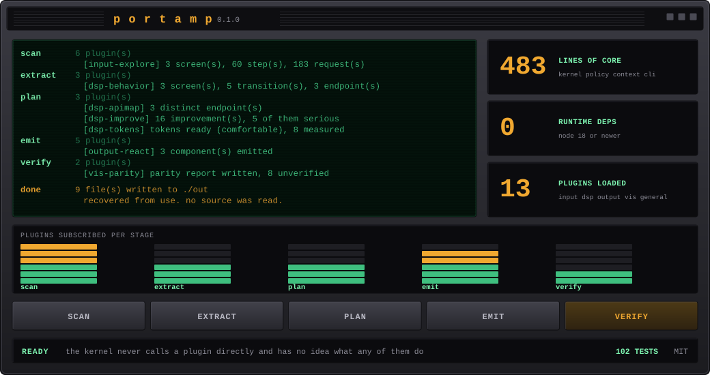
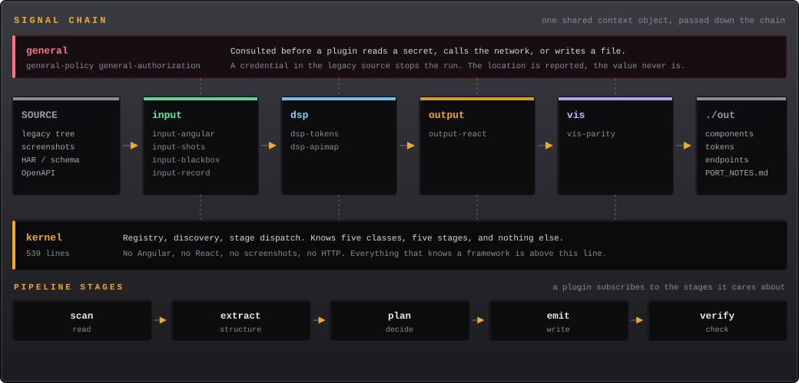
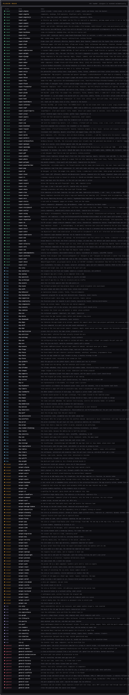
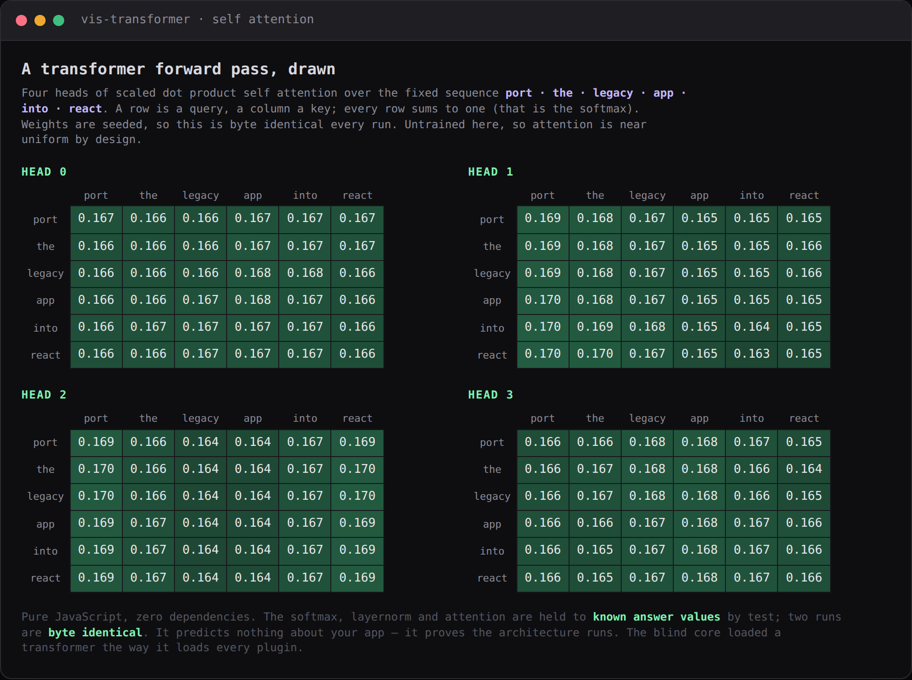
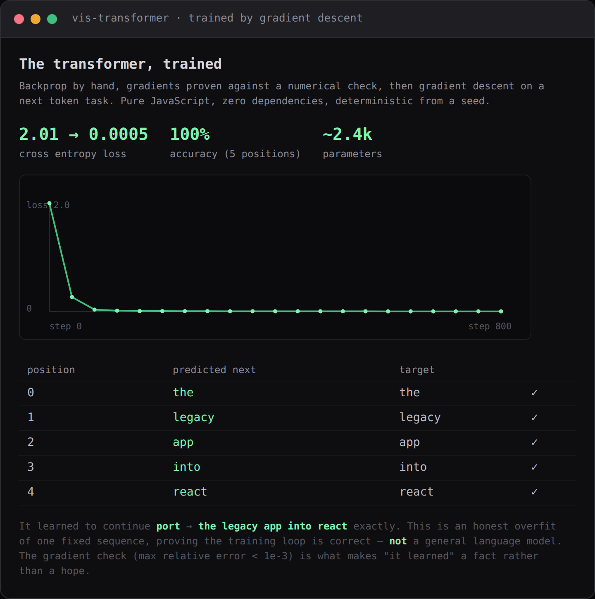
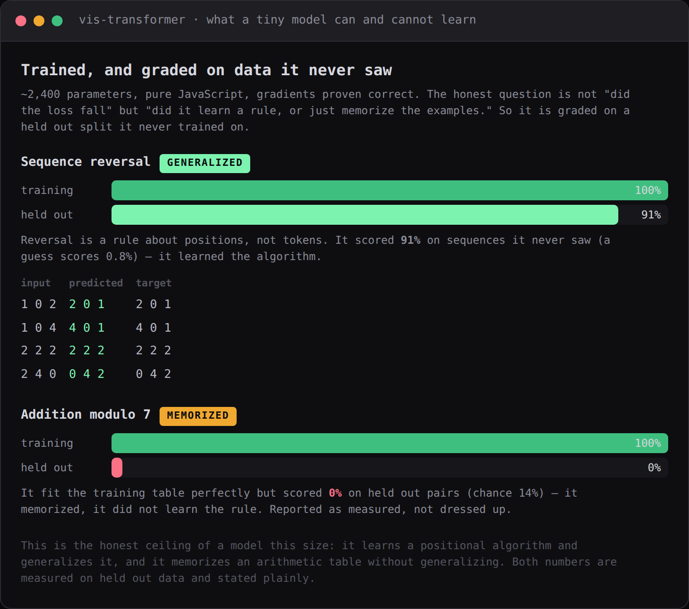
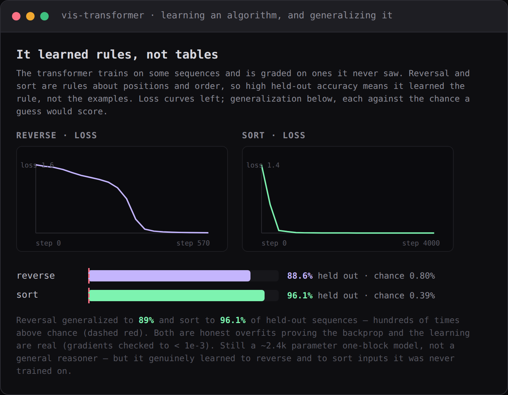
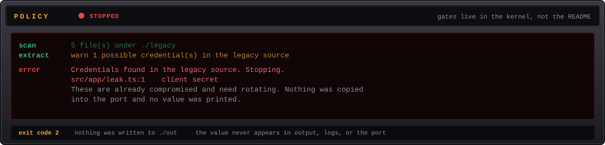
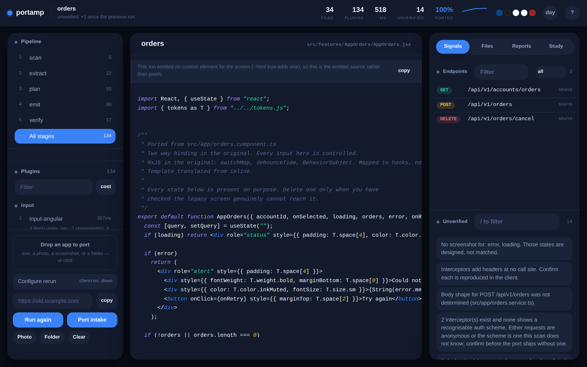

# portamp

Port a legacy front end without losing the look or the API contract.
Four targets: React, Vue, Svelte, and a custom element that depends on nothing.



<sub>portamp is a command line tool, not a desktop app. The chassis is a joke
about where the plugin classes come from. Everything on the panel is real: 718
lines of core, no runtime dependencies, 137 plugins, and the literal output of
`npm run demo`.</sub>


<sub>Proof, not a promise. Every line above is verbatim from `npm test`: 650
tests pass across 71 test files with `node --test` and no framework, and
CodeQL's javascript-security-extended query finds nothing. CI reruns the same
suite on Node 18, 20 and 22 and on Windows, and asserts the same screen written
in two dialects emits byte identical output across all four targets.</sub>

## Why it looks like that

Winamp shipped five plugin classes: input, output, DSP, visualization, and
general purpose. The core decoded nothing by itself. It loaded plugins, handed
them a buffer, and got out of the way, which is how one small executable ended
up playing formats its authors had never heard of.

portamp is that idea pointed at front end migration. Same five classes, same
small core, same rule that everything interesting lives outside it. `input`
reads a legacy app instead of a file, `dsp` transforms what was read, `output`
writes components instead of audio, and `vis` shows you what you got.

## Thirty seconds

```bash
git clone https://github.com/drewc611/portamp && cd portamp
node src/cli.js plugins      # 137 plugin(s)
npm run demo                 # runs the pipeline against example/legacy
npm test                     # 651 tests, node --test, no framework
```

No install step. No build step. Node 18 or newer and nothing else.

```
scan      2 screenshot(s), states: default, empty
extract   1 component(s), 3 call(s), 2 interceptor(s)
plan      3 distinct endpoint(s)
          tokens ready (density compact, accent #004B87), 1 value(s) measured
          no font or icon set needing a licence check
emit      1 token pair(s) under AA, 0 of them badly
          1 component(s) emitted, 1 template(s) translated
          states suite written; it reads the emitted components back
verify    parity report written, 14 item(s) unverified

done  34 file(s) written to ./out
      14 item(s) could not be verified, see PORT_NOTES.md
```

Fourteen unverified items on a tiny example is the tool working, not failing.
Each one is a thing it declined to guess.

## The size of it

The constraint is the feature. A core small enough to read in one sitting is a
core you can be sure about, and it is the only reason the plugin boundary stays
honest: there is nowhere in 718 lines to hide a special case for Angular.

| | |
| --- | --- |
| Core | **718 lines** across four files |
| Every line of the tool | 40,067 lines of JavaScript |
| Tests | 8,634 lines, 651 cases |
| Source on disk | src 44 KB, plugins 2.0 MB |
| Runtime dependencies | **none** |
| Build step | none |

```bash
cat src/core/*.js src/cli.js | wc -l    # 718, and the suite fails if this table drifts
du -sh src plugins                      # the whole tool
```

The core grew from 527 lines to 718 across five hundred and fifty two features, and every
one of those lines is a rule earning its place: sharper policy gates, the
explanations a stopped run prints, the flags the workbench needed. Nothing in
`src/` knows a framework. Capability arrives in `plugins/`, and the suite
holds this table to the real numbers so the claim cannot quietly rot.

The artwork in this README lives in `media/`, which is deliberately outside the
`files` list in `package.json`. Pictures are for the repository. They have no
business in the tarball.

## Architecture



Five plugin classes and five pipeline stages, in order: `scan`, `extract`,
`plan`, `emit`, `verify`. A plugin subscribes to the stages it cares about and
mutates a shared context. The kernel never calls a plugin directly and has no
idea what any of them do.

Writing one is about thirty lines:

```js
export default {
  name: "output-storybook",
  version: "0.1.0",
  class: "output",
  setup({ on, log, policy }) {
    on("emit", async (ctx) => {
      for (const s of ctx.screens) {
        await ctx.write(`src/features/${s.selector}/${s.selector}.stories.jsx`, story(s));
      }
      log.info(`${ctx.screens.length} stories`);
    });
  },
};
```

Drop it in `./plugins/` and it loads. No registration file, no build step. The
full contract is in [`docs/PLUGIN-API.md`](docs/PLUGIN-API.md).

## The 137 it ships with



## Yes, there is a transformer in it

Two of them, in fact, because the word means two things and both fit the rule
that everything interesting lives in a plugin the core cannot name.

`vis-transformer` is the neural network kind: a real self attention forward
pass in pure JavaScript, no dependency. Token embeddings, sinusoidal positions,
multi head scaled dot product attention, softmax, residual and layernorm, a
feed forward block. The softmax, the layernorm and the attention are held to
known answer values by test, the weights are seeded so two runs are byte
identical, and it runs over a fixed declared sentence, so it makes no claim
about your app. Run it with `--transformer true` and it draws its attention:



The weights are untrained here, which is exactly why the attention is near
uniform. That is the honest picture of an untrained transformer, and it is the
point: the blind core loaded a transformer the same way it loads every plugin,
and still has no idea what one is.

And then it learns. Run it with `--train true` and the backward pass, its
gradients proven correct against a numerical check, drives gradient descent on
a next token task until the loss falls from about two to a thousandth and every
position's top logit is its target:



It overfits one fixed sequence on purpose, so it is a proof the training loop is
correct, not a general language model, and it says so. The gradient check, a max
relative error under a thousandth between the analytic and numerical gradients,
is what makes "it learned" a fact rather than a hope. Around twenty four hundred
parameters, learning to continue `port` into `the legacy app into react`.

And it does more than memorize one sequence. The honest question for a model
this size is not whether the loss falls but whether it learned a rule or just
the examples, so it is graded on a held out split it never trained on. Run
`--train-reverse true` and `--train-math true`:



Sequence reversal is a rule about positions, not tokens, so the block learns it
from some sequences and applies it to ones it never saw: `91%` held out against
a `0.8%` guess. That is genuine generalization, an algorithm rather than a
table. Addition modulo 7 is the honest counterexample: it fits the training
table perfectly and scores at chance on held out pairs, because generalizing
modular addition needs a longer regime than a demo this size runs. Both numbers
are measured on held out data and REVERSE.md and MATH.md state them plainly,
the win and the limit alike, because a held out number quietly rounded up is
the one lie this tool exists to refuse.

Sorting is the harder rule, because it must preserve how many of each duplicate
a sequence carries rather than move fixed positions. Run `--train-sort true` and
the block fits the training sequences completely and sorts held out ones it
never saw:



Sort reaches `96%` held out against a `0.39%` guess, so the block learned to
sort sequences it never trained on rather than memorize the table, its
gradients checked to under a thousandth like every other path. It is still a
roughly twenty four hundred parameter one block model, not a general reasoner,
but reversal and sort are two algorithms it genuinely learned and applied to
inputs it had never seen.

`output-codemod` is the other kind, a code transformer: it lifts CommonJS to ES
modules, performing only the rewrites it can prove from the shape of the line
and refusing the rest, a dynamic `require` left verbatim and named in
CODEMOD.md rather than guessed. Run it with `--codemod true`.

## Deploy the port to any of six clouds

The site engine already writes a full application and a zero dependency server.
Six output targets turn that same site model into infrastructure as code, each a
deterministic plan the user reviews and applies with their own credentials. None
of them takes a secret; taking a credential is what the secret gate refuses.

| target | hosting | the 301 map becomes | you apply with | flag |
| --- | --- | --- | --- | --- |
| AWS | S3 + CloudFront | a CloudFront function | the `aws` CLI | `--aws true` |
| Google Cloud | Cloud Storage + Cloud CDN | URL map redirect rules | `gcloud` / `gsutil` | `--gcp true` |
| Azure | Storage static site + Front Door | Front Door rules | the `az` CLI | `--azure true` |
| Cloudflare | Pages | a `_redirects` file | `wrangler` | `--cloudflare true` |
| Vercel | Vercel | `vercel.json` redirects | the `vercel` CLI | `--vercel true` |
| Netlify | Netlify | a `_redirects` file | the `netlify` CLI | `--netlify true` |

Each emits the host's own config, a deploy script that reads your own configured
credentials from the environment, the flattened redirect map so every retired
address keeps answering, and a README that names DNS, the certificate and the
account's own specifics as yours to fill in rather than guessing them. It knows
how to architect the hosting because the rules are written and tested, not
learned.

## Ask a real model for the architecture, securely

The six targets above are rules portamp wrote. When the design question is
harder than rules, `general-architect` asks a genuine frontier model through the
Anthropic API to propose an architecture for the app the run just read, built
from its real endpoints and routes. It is honest about what it is: the answer is
the external model's, not portamp's own transformer, and `ARCHITECTURE.md` marks
every word of it unverified, a proposal a human architect must prove.

It never asks you to hand over a key. The key lives only in your own
environment; portamp reads it at the moment of the call and never prints, stores
or commits it. The call is a live, billable one, so it is refused by default and
runs only when you open both gates and attest who you are calling:

```bash
export ANTHROPIC_API_KEY=...           # stays in your shell; portamp never sees it leave
node src/cli.js run --src ./app --out ./port \
  --architect true --allow-live true --allow-billable true \
  --architect-ask "Design this for 50k daily users on AWS, and note the GCP and Azure differences."
```

Without `--allow-live` the run refuses rather than reaching the network, the
same refusal every live plugin gives. portamp's own transformer cannot design a
system and does not pretend to; this is the honest bridge to a model that can.

When one opinion is not enough, `general-agents` runs a small system of agents
over the port's own reports. It is retrieval augmented: a dependency free BM25
style ranker pulls the passages relevant to a question from the reports the run
already wrote (that is the retrieval, over the tool's own words, no vector
database), and hands each to a specialised agent, an architect, a security
reviewer, a cost analyst and a reliability engineer, each a call to a real
model with its own role. A synthesiser agent reconciles them into one
recommendation. `AGENTS.md` shows which report fed each agent, so the retrieval
is auditable, and marks the whole thing unverified. Same gates, same key
handling as above; run it with `--agents true --allow-live true --allow-billable
true`.

## What a translation looks like

The example's template, and what portamp emits for it:

```html
<div *ngIf="loading">Loading</div>
<table><tr *ngFor="let o of orders"><td>{{o.id}}</td></tr></table>
<input [(ngModel)]="query" />
```

```jsx
{loading && (
  <div>
    Loading
  </div>
)}
<table>
  {orders.map((o) => (
    <tr key={o.id ?? o}>
      <td>
        {o.id}
      </td>
    </tr>
  ))}
</table>
<input value={query} onChange={(event) => setQuery(event.target.value)} />
```

The component around it declares `useState` for `query` because the two way
binding needed it, takes `orders` and `loading` as props because the template
reads them, and keys the loop. What it could not do faithfully it says out loud:
a `| currency` pipe becomes an unformatted value and a line in `PORT_NOTES.md`,
never a formatter somebody guessed at.

## Anything in, anything out

The tool was built to port Angular to React. It is not shaped that way any more.

Every reader turns its own dialect into one intermediate representation, and
every emitter turns that back into its own target. Without the middle, porting
N frameworks to M frameworks is N times M translators and the second target
costs as much as the first. With it, a reader is a dialect table and an emitter
is a printer.

```
  input-angular ─┐                             ┌─ output-react
  input-vue     ─┤                             ├─ output-vue
  input-jquery  ─┼──▶  dsp-ir  ──▶  the IR ──▶ ┼─ output-svelte
  input-explore ─┤                             ├─ output-html   (no framework)
  (used, not read)                             ├─ output-storybook
                 │                             └─ output-tests
```

The IR says what markup means, not how anybody spells it: `when`, `each`,
`element`, `text`, `slot`, `html`. `*ngIf` and `v-if` are the same node by the
time anything downstream sees them, and so are `[class.x]` and `:class`.

The proof is not a diagram. This screen, written twice:

```html
<div *ngIf="loading">L</div>
<li *ngFor="let o of orders" [class.hot]="o.hot" (click)="pick(o)">{{o.n}}</li>

<div v-if="loading">L</div>
<li v-for="o in orders" :class="{hot: o.hot}" @click="pick(o)">{{o.n}}</li>
```

produces byte identical React, Vue, Svelte and custom element output, from both.
CI asserts all four. Each printer is around 150 lines and nothing upstream
changed to add any of them, which is the only honest way to claim the middle is
framework blind.

Each target gets what its own language does best rather than a lowest common
denominator: Svelte gets `class:hot={o.hot}`, Vue gets `:class="{ hot: o.hot }"`,
React gets a joined string, because a printer per target beats one shared
printer that speaks nobody's language well.

`output-html` is the one worth reading. A custom element supplies no renderer,
no way to spell a condition and no way to attach a handler, so the printer
answers all three itself: markup prints as a template literal with every value
escaped, and handlers are indexed and attached by one delegated listener per
event type, on the shadow root rather than the host. It is the target that
makes the portable claim checkable, because emitting to a platform with no
framework at all needed nothing upstream to change.

## It reads what your decade actually shipped

Angular, AngularJS, Vue, Svelte, Lit, Alpine, Knockout, Backbone, jQuery,
Polymer, Riot, React, a facelets tree, a WebForms tree, an OpenAPI document, or
a running app with no source at all. Each reader turns its world into the same middle,
which is why the emitters never learned any of their names. Svelte's `{#each}`
and `{#if}` blocks become transparent containers the middle sees through, its
`on:event` an event and its `bind:value` a two way model; Lit's `html` template
comes across the same way, `@event` an event, `?disabled` a directive, `.value`
a model and `${list.map(...)}` a loop, so a Lit component reads back into the
same middle it was emitted from. A screen ports on to React or Vue with nothing
target specific added.

And it writes this decade back out: React, Vue, Svelte, modern Angular with
the block syntax, Lit, or a custom element that depends on nothing, plus the
proofs beside them: a conformance suite, mocks that carry nobody's data, a
spec that admits what it never saw, stories for every state of every target.

## A folder of old pages becomes an application

The oldest front end there is: a directory of .html files, some .php, an
.shtml with server side includes, a frameset, a page that still opens with
`<font color="red">`. There was never a framework to read. There is still an
application in there, and `--site true` builds it:

```bash
npm run demo-site      # example/legacy-site → example/out-site
```

Every page becomes a routed React component. The nav and footer the pages
repeated verbatim leave them and become the layout, once. Internal links are
rewritten to routes and one document level click listener makes plain anchors
navigate; the router is emitted with the port, has no dependency, and its pure
matcher ships with its own tests that run inside the port. Every old address
keeps working: `/about.html` redirects to `/about`, a meta refresh page joins
the redirect map instead of the screens, and the map is written three ways —
`redirects.json`, `_redirects`, and an nginx block. Titles, descriptions and
og tags are reapplied per route because a single page app forgets them.
Stylesheets and images travel as bytes into `public/`.

The old web's spellings are read for what they meant: `<font>` becomes a
styled span with the seven sizes browsers actually used, `onclick` and
`javascript:` hrefs become the handlers they always were, PHP and ASP blocks
are stripped and counted as named gaps, SSI includes resolve from the tree
the way the server resolved them, and a frameset is read as the layout it
was. What cannot be known is reported: dead links dangle where they dangled,
orphan pages are named, `news-1.html`/`news-2.html` are proposed as one
parameterized route rather than merged by guesswork, and `SITE_MAP.mmd` draws
the whole graph so the gaps have a picture.

And the port is full stack, not a folder of JSX: it lands with its own zero
dependency server (`npm run serve`) that serves the app, answers every retired
address with the real 301 the redirect map promised, and answers the API
surface honestly — a fixture where the run emitted one, marked as invented,
and a 501 naming `src/api/endpoints.js` where it did not — plus the router and
server test suites, which run inside the port with `npm test`. The engine was
proven against `example/legacy-portal`, a fictional postal service portal with
the shapes of the real ones, and smoke tested against a real government
developer portal's public pages.

## A data sheet becomes a page

Technical documentation shipped as PDF is legacy front end too, and
`input-pdf` reads it with no dependencies: PDF's one compression that
matters is Flate, and Node ships it. The reader takes the file apart by
linear scan so hand-edited and broken files still read, keeps every text
run with its measured position and size, sizes the headings the way the
document actually set them (body text is the size most characters wear;
anything larger becomes h1, h2, h3 with anchors and a table of contents),
lists the link annotations exactly as spelled, and reports the document's
own outline beside the measured one.

Drop a PDF next to the pages and `--site true` gives it a route, redirects
the old `.pdf` address to it, and copies the original in byte for byte —
the PDF stays the document of record, linked from its page. The port's own
search engine finds the document by its words. What cannot be decoded is
counted, never faked: an encrypted file is refused by name, an exotic
stream filter is skipped and said, and a glyph with no text mapping is a
number in `DOCS.md`, not a lookalike character.

## The port stops repeating itself

Every emitter writes one component per screen, so a block three pages
carried verbatim becomes three copies of the same code. `dsp-components`
finds those repeats — block-level fragments that recur byte for byte across
two or more screens, found by counting each tag's own opens and closes so a
nested block never ends its parent early — and with `--components true`
lifts each static one into a single shared component the pages compose from:

```bash
node src/cli.js run --src ./site --out ./port --site true --components true
```

The extraction is framework blind by construction, not by a special case.
It adds the shared block to the run as a component and rewrites the pages to
name it; every target already resolves a tag naming another screen to that
component, so React, Vue, Svelte and the custom element all pick up
`<PortJoinTheNewsletter />` with nothing target-specific added — the whole
thesis of the tool, demonstrated by a feature that touched no printer.

It performs only the safe case. A repeat that binds or interpolates reads
screen-local state a shared component would not have, so parameterizing it
is a guess about what varies; those are named in `COMPONENTS.md` and left
for a person, exactly like every other proposal the tool declines to
perform. Nested repeats collapse to the largest, two runs write byte-
identical components, and the catalog is written flag or no flag, because
knowing the repeats exist is worth as much as removing them.

The commoner repeat is not byte identical, though: two cards or two rows
with the same structure and different words. `dsp-props` finds those. It
reduces each block to its skeleton — the markup with every text and
attribute value blanked to a marker — groups the blocks that share a
skeleton across screens, and where the blanked slots disagree names each
disagreeing slot as a prop with the values it observed. A shape whose every
slot agrees is an exact repeat and left to `dsp-components`; the rest land
in `PROPS.md` as parameterized proposals, named and never lifted, because
which slots are allowed to vary is a decision about the product.

## On your desk and in your pocket

The console is an installable app now, in both senses that actually make sense
for a tool whose pipeline runs where Node runs:

- **Desktop.** `desktop/` wraps the console in a window; the pipeline, the
  policy gates and the server inside it are imported from this repository, so
  the app can never disagree with the CLI about what a run did. CI builds the
  installers where installers have to be built: a `.dmg` on macOS runners, an
  NSIS installer on Windows, an AppImage on Linux, on every version tag.
- **Phone.** The served console is a progressive web app: install it from the
  browser and the rack, the wipe and the unverified list are on your phone.
  The shell caches; the run data deliberately never does, because a report
  that silently shows yesterday's run is worse than one that says it cannot
  reach the server.
- The server still binds 127.0.0.1 only, in every wrapper. A window in front
  of the console does not change what it serves, or to whom.

## It works out what it is looking at

A codemod translates syntax. It has no opinion about what the application *is*,
so it cannot have one about what it should become, and you get the same app with
newer punctuation.

`dsp-archetype` reads the structure, not the framework, off the same IR
everything else uses. So it answers the same question whether the app arrived as
Angular, as Vue, as jQuery, or as a running thing somebody drove with no source
at all.

```
[dsp-archetype] crud-table (3/4 signals), 2 observation(s)
[dsp-modernize] 7 decision(s) proposed for a crud-table
[dsp-uplift]    6 colour pair(s) brought to contrast, 2 already passing
```

It never reports only a verdict. Every candidate carries the signals it matched
and the ones it did not, because what a rule looked for and failed to find is
exactly what would have to be true for the answer to be different:

```
### Table of records, edited in place  (crud-table)
Matched 3 of 4 signals, 75%.
- 1 table(s)
- 1 read endpoint(s)
- 2 write endpoint(s) on the same resource
1 signal(s) this shape usually shows were not found.
```

When two readings land within twenty points the report says so and sets out
both, rather than picking one and sounding certain.

`dsp-learn` reads the same screen a second way, with a model instead of rules. It
turns each screen into a vector of the features the rules already trust and trains
a nearest prototype classifier on twenty two labelled archetype miniatures, two per
class, so a new screen is placed by its nearest exemplar in a standardization
learned from the corpus rather than by which rules happened to fire. `LEARNED.md`
ranks every archetype by distance with a softmax confidence, and reports a real
held out number: two exemplars per class make a leave one out cross validation
defined, so it leaves each out in turn, retrains on the rest, and scores whether
it gets the unseen one right, naming the ones it missed and keeping the robustness
curve beside it.

```
[dsp-learn] learned reading: crud-table (18%), leave one out 95% over 22 exemplars
```

The two readings are meant to be read together. When the learned model and the
rules agree that is worth more than either alone; where they disagree, `LEARNED.md`
says the disagreement is the thing to look at, and marks the whole reading a
proposal, because a model can be confidently wrong most easily on an app whose
shape sits between two archetypes.

Then `dsp-modernize` turns the reading into a plan, and every decision names the
thing in the old app that makes it necessary, so you can disagree with the
premise instead of the taste:

> **Put the filters in the address bar**
> **Because** filter state lives in the component, so a filtered view cannot be
> linked, bookmarked, or restored by a reload.
> **Instead** the query string is the source of truth.

It proposes and does not perform. How an application fetches, routes and holds
state is a decision about the product, and a tool that made it quietly would be
worse than one that did not make it at all.

### And it makes it look like something from this decade

`dsp-uplift` does the visual half, under one rule: **a legacy palette contains
one thing somebody genuinely chose, and a lot of things nobody did.**

The brand colour is kept. What changes is lightness, and only as far as a
contrast ratio requires:

```
inkMuted on surface   #999999 -> #757575    2.85:1 -> 4.61:1   moved -14%
accent   on surface   #5BA4E6 -> #1F79CB    2.66:1 -> 4.51:1   moved -17%
warn     on surface   #E8C25D -> #927015    1.71:1 -> 4.61:1   moved -31%
ink      on surface   #555555 -> #555555    7.46:1 -> 7.46:1   kept
```

Same blue. Readable now. A pair that already passed is not touched, and on a
dark ground it lightens rather than inverting, because a palette that flips a
colour to meet a number has stopped being the same palette. CI asserts no run
ever lowers a ratio.

The type scale is the app's own, recovered by fitting a line through its sizes
rather than imposed. An app whose display size is 28px next to a 13px body has
made a decision, and replacing it with 19px because a minor third says so is a
redesign nobody asked for:

```
was      xs 10   sm 11   md 13   lg 18   xl 28
becomes  xs  8   sm 10   md 13   lg 17   xl 22   2xl 28
```

Elevation, motion, a focus ring and a spacing rhythm are added outright, because
an app written before those were easy has nothing there to preserve. The shadows
are tinted with the palette's own ink rather than black, which is the difference
between a card that looks placed and one that looks pasted.

All of it lands in `src/tokens.modern.js` and `src/tokens.modern.css`. The
emitted components keep importing `src/tokens.js`. Adopting a new palette is not
a thing to do to somebody quietly.

## Conformance: the part nobody else does

Every codemod hands you code. None of them tells you whether what you now have
still behaves like what you replaced.

portamp already walked the old app and wrote down what each action did: which
screen it opened, which request it fired, what the app said when it refused.
That is a test suite. `output-tests` writes it, against the port.

```js
test("clicking Create order does what it did in the original", async ({ page }) => {
  await page.goto(base);
  await page.getByRole("button", { name: "New order" })...click();

  await page.getByRole("button", { name: "Create order" })...click();

  // The original refused, in these words. A port that accepts this
  // input has lost a rule nobody wrote down anywhere else.
  await expect(page.getByText("Customer is required", { exact: false })).toBeVisible();
});
```

Nothing in that was written by hand. The rule is there because submitting the
empty form made the old app say so, and the step replays the click that opened
the screen because the exploration recorded how it got there.

Run it against the original and it passes, nine for nine. Run it against a port
that quietly dropped the validation and renamed a heading, and it fails on
exactly those two and nothing else:

```
  7 passed
  2 failed
    clicking Create order does what it did in the original
    clicking New order does what it did in the original
```

That is the whole point. A port is not finished because it compiles.

## What it actually does

**Reads the old app.** Walks the Angular tree, finds components, inputs and
outputs, structural directives, two way bindings, RxJS operators, services that
talk to `HttpClient`, and interceptors. Interceptors matter more than they look:
they add headers at no call site, which is the single most common thing a port
drops silently.

**Reads the screenshots.** Catalogs them and infers which state each one shows
from its filename, so `orders-empty.png` is understood as the empty state. Then
it tells you which states have no screenshot, because those get designed rather
than matched and somebody should know which is which.

**Recovers a system, not pixels.** Emits a token file (density, type scale,
spacing, color roles, radius, elevation) and builds from that. Copying pixels
inherits every inconsistency the old app accumulated and leaves the first new
screen with nothing to follow.

**Regenerates the API layer.** One endpoint map and one client with timeout,
retry with backoff and jitter, cancellation, and normalized errors. Components
never contain a URL.

**Writes down what it could not verify.** `PORT_NOTES.md` lists every screen
with no matching screenshot, every request body it could not determine, and
every interceptor you need to confirm by hand. The next person inherits that
uncertainty either way.

## When there is no source

Most legacy modernization starts with a system nobody can build anymore. The
binary runs, the repo is missing or does not compile, and the person who wrote
it left in 2016.

The answer is to use the thing. `input-explore` drives the running app the way
a person would, and writes down what it learns.

```
portamp run --allow-live

[input-explore]  3 screen(s), 60 step(s), 183 request(s), 0 skipped
[dsp-behavior]   3 screen(s), 5 transition(s), 3 endpoint(s) recovered from use
[dsp-improve]    16 improvement(s) over the original, 5 of them serious
[output-react]   3 component(s) emitted
```

It clicks what it finds, fills forms and submits them empty to see what the
validation says, and follows what opens. Rows in a table are found the only way
a legacy app reliably announces them: `cursor: pointer`. Each step runs from a
fresh load, so one action cannot poison the next.

Out of that comes `BEHAVIOR_MODEL.md`, which is the app as it behaves:

```
### New order  `screen-3`
- Kind: form
- Seen in: body. Never seen in: loading, empty, error

| field      | type | required | rule the app stated  |
| ---------- | ---- | -------- | -------------------- |
| `customer` | text | yes      | Customer is required |

## Flow
screen-1 --[ a row ]--> screen-2
screen-1 --[ New order ]--> screen-3
screen-3 --[ Create order ]--> screen-1

## Endpoints
| GET  | `/api/v1/orders`     | q | 200 | none                    | Search, a row |
| GET  | `/api/v1/orders/:id` |   | 200 | none                    | a row         |
| POST | `/api/v1/orders`     |   | 201 | `{"customer":"string"}` | Create order  |
```

Nothing there was assumed. `customer` is required because submitting without it
made the app say so. `:id` is a parameter because several paths differed only in
that segment; one example would have stayed a path. The request body is recorded
as types, never as values, so whatever got typed during the exploration is not
written down anywhere. Neither is a customer name: a control labelled with the
record it sits on becomes "a row".

### Making it better, not copying it faithfully

A port that reproduces the original's defects is not a good port. `dsp-improve`
measures the original while it runs and says what the rebuild does instead:

```
## Controls with no accessible name (1)
- `#refresh` on `screen-1`, high.
  - Observed: Its only content is "↻", which carries no name for a screen reader.
  - Instead: The rebuild gives it an aria-label.

## Text below the contrast threshold (1)
- `p` on `screen-1`, high.
  - Observed: rgb(187,187,187) on rgb(251,250,248) is 1.84:1 at 12px, under
    the 4.5:1 this size needs.

## States the original never showed (5)
- `list-screen`, high.
  - Observed: No error state was seen across the whole exploration, and it
    loads data.
  - Instead: Without one a failed request leaves the last good screen up,
    which reads as success.
```

Contrast is the WCAG ratio, computed from the colours as they rendered. Tap
targets are measured. A state is reported as never seen rather than as absent,
because the explorer not reaching something is not proof it does not exist.

### Replaying instead of re driving

An exploration is a recording. Drop `exploration.json` beside the screenshots
and the whole chain runs again with no browser, which is how it is tested:

```bash
portamp run --src ./nosource --shots ./explored --out ./out
```

### What it will not do

Anything that reads as destructive is skipped and listed, never performed.
Exploring somebody's admin panel should not delete a customer.

```
## Not exercised
- `#delete-account` (Delete account): "Delete account" reads as destructive
```

`explore.allowDestructive` exists and is off. Turning it on is a decision about
somebody's production data, so it is a decision you have to make out loud.

**Passive, when you cannot drive it either.** Drop whatever survived into
`./artifacts` and `input-blackbox` reads it: a HAR of the app's traffic, a schema
dump (usually the most honest description of a legacy app's real data model), an
OpenAPI export if one exists, report exports whose column headers reveal field
names and formats, and any documentation.

**Recording routes you already know.** `input-record` visits a list of routes
you supply and captures a screenshot, a HAR and the computed styles for each.
Use it when you know the map already and only want the pixels and the traffic.

```js
record: {
  baseUrl: "https://legacy.internal",
  routes: [
    { path: "/orders", name: "orders-default" },
    { path: "/orders?empty=1", name: "orders-empty", state: "empty" },
  ],
  login: async (page) => { /* your auth, your credentials */ },
  redact: ["[data-pii]", ".customer-name"],
}
```

```
npm i -D playwright && npx playwright install chromium
portamp run --allow-live
```

Recorded calls land in the same inventory shape as calls read from source, so
every downstream plugin treats them identically. The report says which came
from where, and flags the obvious limit: a path never exercised during
recording does not exist in the inventory.

Redaction happens before the shutter, not after. Screenshots of a real system
carry customer names and account numbers, and a blurred element in a committed
PNG is still better handled by never capturing it sharp.

## Authorization, for the no source path

Modernizing software you own is ordinary engineering. Reconstructing software
you do not own is a different activity with a different name. Both no source
inputs require an attestation on disk before they will run:

```json
{
  "system": "Claims Intake, internal web app",
  "owner": "Acme Insurance",
  "relationship": "owner",
  "basis": "Internally developed and owned outright.",
  "attestedBy": "A. Clark",
  "attestedOn": "2026-08-30",
  "sourceAvailable": false
}
```

`relationship` is `owner`, `licensee`, or `contractor`. A licensee has to
affirm the license permits derivative works, because many do not and a port is
one. A contractor has to name the engagement. A basis describing license or
protection circumvention is refused outright, regardless of who owns what.

## Policy is in the kernel, not the README



Rules the kernel enforces, not suggests:

- A credential in legacy source stops the run at `extract`, before anything is
  written. The location is reported, the value never is, and nothing is copied
  into the port.
- An endpoint that reached a component fails the run at `verify` and names the
  file. It is checked against the endpoint map rather than by looking for
  URL shaped strings, so a template that links to documentation still ports.
- The policy object is frozen once built. A plugin that finds a gate
  inconvenient cannot reassign it.
- Live calls are off by default. `--allow-live` is a statement that you are
  authorized to call the thing.
- Billable endpoints need `--allow-billable` on top of that, because some
  endpoints charge per request and a test suite pointed at production invoices
  the customer on every run.
- Fixtures that look like they contain real customer data get flagged before
  they reach a repository.

A plugin that wants to do something consequential asks the policy object first.

## The UI

`portamp ui` serves the last run on `127.0.0.1:4321` and opens a browser.



Four panes, fixed. No routing, no tabs that hide things.

- **Plugin rack**, left. Every loaded plugin grouped by class, what it
  contributed, and what it cost. This is the reason the UI is worth building:
  you can see which plugin produced which part of the output, which is what a
  plugin architecture needs to stay debuggable.
- **Side by side**, main. The recorded screenshot and the emitted component with
  a wipe between them. Drag it, or focus it and use the arrow keys: it is a real
  range input underneath, so the keyboard and a screen reader work without
  anything extra. When there is no screenshot the pane says so and the wipe
  disappears, because a wipe between a message and some source is not a
  comparison.
- **Endpoints**, lower right, each marked `source` or `observed`.
- **Unverified**, bottom bar. Always visible, never behind a click. It is the
  list people need and the one they will avoid if it is collapsed.

It is a `vis` plugin, which is the Winamp slot exactly: the core does the work,
the visualization plugin shows it. Nothing about it is required to port
anything, and `portamp run` never loads it.

The constraints are the interesting part:

- **Zero dependencies.** `node:http` and one HTML file with inline CSS and JS.
  The tool that ports apps to React does not itself need React, and adding a
  build step to a tool whose selling point is having no build step would be
  funny for about a day.
- **Read only.** It displays a completed run. It cannot trigger one, edit a
  file, or write anything. A UI that mutates the port is a second source of
  truth. A test asserts the server contains no write call.
- **Loopback only.** It binds `127.0.0.1`, never `0.0.0.0`, because it serves
  screenshots of a customer system. A test asserts the bound address, and both
  file routes refuse any path that climbs out of their directory.
- **Under 800 lines**, including the HTML. It is 659, and a test fails the build
  if that stops being true.

The built component cannot be rendered without a build, so the right pane shows
the emitted source, syntax highlighted, and says that is what it is rather than
pretending to be a preview.

## Configuration

`portamp init` writes a starter file. Everything is optional.

```js
export default {
  src: "./legacy",
  shots: "./screenshots",
  out: "./out",
  plugins: [],          // ./plugins is automatic; list extra paths here
  tokens: {},           // override anything the extractor infers
  allowLive: false,
  allowBillable: false,
};
```

## Commands

```
portamp run          run the pipeline
portamp ui           serve the last run at 127.0.0.1:4321
portamp plugins      list what is loaded, and what commands they add
portamp init         write a starter config
```

Useful flags: `--only name,name` to run a subset, `-v` for plugin timings,
`--allow-live`, `--allow-billable`.

## Layout

```
src/core/kernel.js     plugin registry, discovery, pipeline
src/core/policy.js     the rules, enforced
src/core/context.js    shared context and logger
src/cli.js             argument parsing and wiring
plugins/*/index.js     everything that knows a framework
skills/                six agent playbooks, from legacy-to-react to port-audit
docs/PLUGIN-API.md     write your own
example/legacy         a small Angular app to read
example/blackbox-app   a running app to use, never read
test/                  node --test, no framework
media/                 the artwork in this README, out of the package
```

## Bundled skills

`skills/` holds six playbooks for use with an agent, and they work
standalone. The plugins measure; the skills carry the judgment the
measurements leave to a person.

- **legacy-to-react** is the judgment the tool cannot mechanize: extracting a
  design system from screenshots, the construct by construct framework mapping,
  the API traps, and the parity checklist.
- **adhd-brief** writes for a reader whose attention is expensive, in four
  layers: reading the reader's state before answering, the answer shape
  (answer first, three supporting lines, stop), the work behind the reply
  (one file instead of the directory, no re reading context, no restating
  tool output — where the token spend actually is), writing people must act
  on (one action per step, at most four choices, absolute dates, no forward
  references), and the rewrite recipe for every finding dsp-cognitive
  measures. It never trades away a real risk or an exact number for brevity.
- **plain-language** repairs the words that ship inside a product: one verb
  per action everywhere, links that say where they go, abbreviations
  expanded once, walls broken at the topic turn, error messages that lead
  with the fix. Distinct from adhd-brief on purpose: that skill shapes
  conversation, this one fixes what COGNITIVE.md flagged.
- **site-port** is the folder of old pages playbook: the flags in the order
  they pay off, which redirect map spelling each host reads, the deploy
  checklist, and the judgment calls the engine deliberately leaves open.
- **doc-port** carries PDF tech documents honestly: what input-pdf proves
  versus skips, the scanned and encrypted cases, when to trust the reading
  versus the original, and the document of record rule.
- **port-audit** decides whether a port ships: the evidence files in the
  right order, the audit command, the three checks only a person can do,
  and severity stated without averaging a broken endpoint against pretty
  pixels.

## Known gaps

Named here so nobody has to discover them as a surprise.

- The template translator handles `*ngIf`, `*ngFor`, interpolation, property and
  event binding, two way binding, `ngClass`, `ngStyle`, `ng-container` and
  `ng-content`. It does not resolve references to other components, so a
  template using `<app-row>` emits `<app-row>` and leaves you to wire it. Pipes,
  `else` branches and unusual `ngClass` shapes are reported, not invented.
- `input-angular` uses the TypeScript compiler API when `typescript` is
  installed and regular expressions when it is not. Neither uses a type checker,
  so a URL assembled from anything but a literal in the same file keeps its
  `${...}` shape rather than being resolved to a guess.
- Spacing is still a default. Nothing measured so far says what the spacing
  scale was meant to be, only what it happened to render as.
- `vis-parity` reports in markdown and compares nothing visually. `vis-diff` is
  the next plugin.

## Where this is going

The plugin classes are the point. Everything below is a directory and an
`index.js`, and none of it needed the core to change.

**Shipped since the first cut**

| | |
| --- | --- |
| `input-vue` | Single file components, into the same shape the Angular reader produces |
| `input-jquery` | A front end that never declared a component, inventoried without inventing one |
| `input-explore` | Drives a running app and works out what it is |
| `dsp-ir` | One representation in the middle, so a target costs a printer |
| `dsp-behavior` | Turns an exploration into screens, fields, flow and endpoints |
| `dsp-improve` | What the original got wrong, measured while it ran |
| `dsp-a11y` | Contrast and target size over the palette the port will use |
| `dsp-i18n` | The copy welded into the markup, and the sentences split around a value |
| `dsp-deadcode` | What is declared and never used, as candidates and never as a verdict |
| `dsp-archetype` | What kind of app this is, from its structure rather than its framework |
| `dsp-modernize` | What to build instead, with the evidence for every decision |
| `dsp-uplift` | The old palette brought to contrast, without losing the brand |
| `dsp-routes` | The route table, because the address bar is half the contract |
| `dsp-boundaries` | Components proposed for an app that declared none |
| component references | A tag naming another screen becomes that ported component |
| `output-vue` | The third target on the IR |
| `output-svelte` | The second target on the IR |
| `output-html` | A custom element, depending on nothing |
| `output-storybook` | A story per component, one per state |
| `output-tests` | A conformance suite, written from what the original did |
| `output-openapi` | The requests the port makes, and no response it never saw |
| `output-msw` | Something for the port to talk to, carrying nobody's data |
| `general-license` | Fonts and icon sets whose licence does not travel |
| `vis-ui` | The comparison view, which is where `vis-diff` landed |

**Still open**

The whole picture is [ROADMAP.md](ROADMAP.md): four hundred and twenty six features in
thirty four phases, forty four shipped, three hundred and seventy nine new in the
current branch, three planned, every status honest. Each open one names
what it waits on; npm publish stays a command that belongs to a person.

portamp is a proprietary product. All rights reserved — see [LICENSE](LICENSE).
What it emits from your own source is yours.
